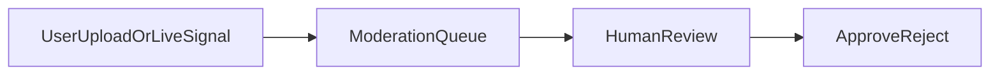

# UGC 审核与风控流程（MVP）

## 1. 范围

- 服务方作品集短视频、需求说明视频、直播封面/标题、公屏互动（若上线弹幕）。
- 高风险类目（装修施工安全提示、联系方式导流诈骗）单独规则。

## 2. 策略矩阵

| 风险等级 | 示例 | 策略 |
|----------|------|------|
| 低 | 工具类屏幕录屏、施工现场全景 | 先发后审 + 抽检 |
| 中 | 含人脸/地址画面 | 先审后发或延迟公开 |
| 高 | 涉黄暴恐政、明显诈骗 | 拦截 + 封号 + 报送（依法） |

## 3. 工单流转

- **入队**：用户举报、模型命中、关键词、举报重复率。
- **处置**：通过 / 拒绝 / 隐藏 / 账号限制。
- **SLA**：MVP 可设「工作日 24h 内首次响应」为目标。

## 4. 与实现的对应

- 数据表：`UgcModerationItem`（Prisma）。
- API：`GET /admin/ugc`、`PATCH /admin/ugc/:id`、`POST /admin/ugc`（测试登记）。
- 静态运营页：服务启动后访问 `http://localhost:3000/operator/`，配置环境变量 `ADMIN_API_KEY` 与请求头 `x-admin-key`。

## 5. 证据与申诉

- 拒绝需记录 **原因码**（内部）；用户申诉通道（邮箱/工单）与复核时限。

## 6. 后续

- 接入第三方人审平台、机审 API、多语言敏感库、直播实时断流策略。
