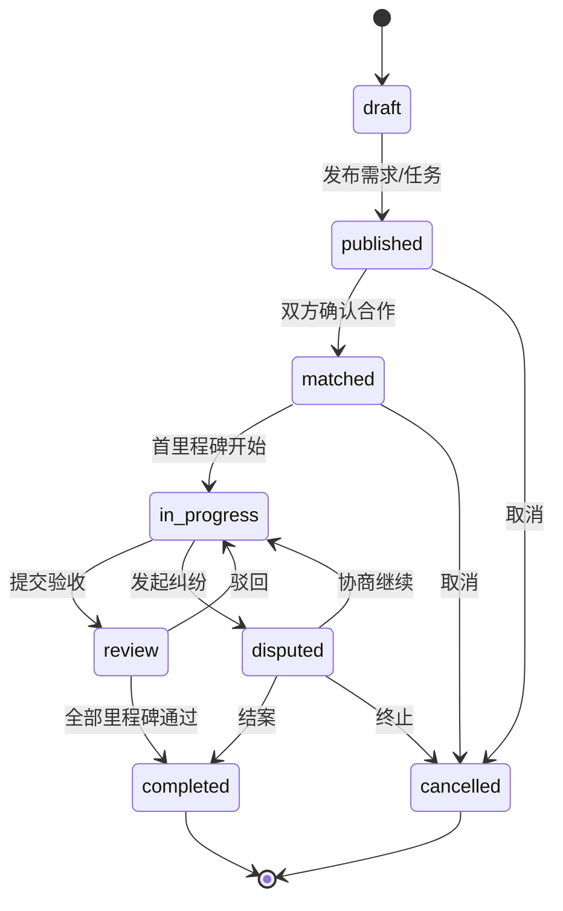
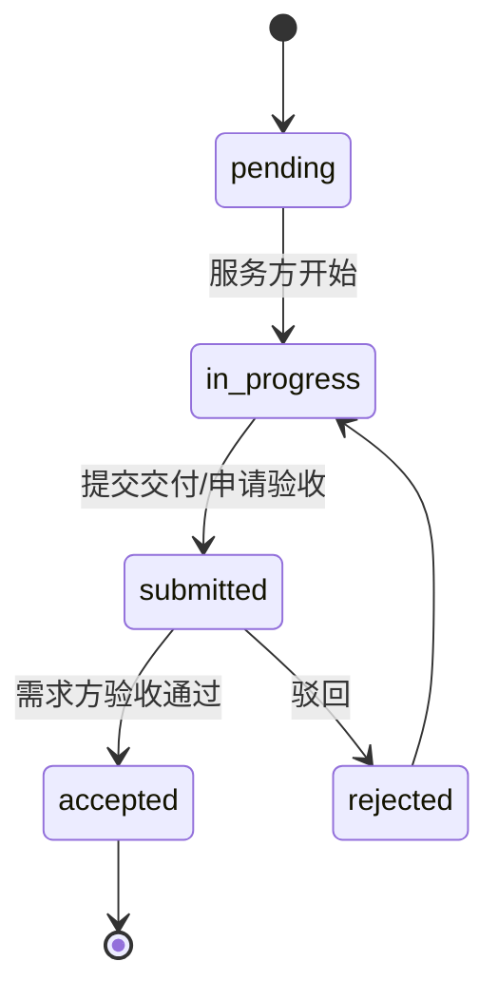

# PRD：视频/直播双边平台 MVP

**版本**：0.5  
**范围**：首发垂直「装修/安装/维修巡检」+ 线下付款记录；1v1 视频、任务里程碑、进度直播绑定。

---

## 1. 用户与场景

- **需求方**：发布需求（视频/文字）、选人、视频沟通、看进度直播、验收里程碑。
- **服务方**：能力主页与案例短视频、报价、开播推进度、提交交付物。
- **运营**：类目配置、内容审核队列、纠纷工单登记（MVP 可为人工表格 + 后台只读/简易操作）。

---

## 2. 功能范围（MVP）

| 模块 | 说明 |
|------|------|
| 账号 | 注册登录、同用户可绑定「需求资料 / 服务方资料」 |
| 能力展示 | 服务方简介、技能标签、作品集（短视频 URL 或对象存储 key）、**预约直播预告**（`scheduledLiveAt` / `scheduledLiveTitle`） |
| 需求 | 结构化字段 + 可选需求说明视频 + **需求摘要**（`needBriefSummary`：口播/语音转写后的文字摘要，可由人工粘贴或后续 ASR 服务写入） |
| 任务单 | 统一承载大小单；关联需求方、服务方；**结构化字段**：预算区间（最小/最大分）、周期（天）、交付物类型、驻场/远程（`remote` / `onsite` / `hybrid`）、需求说明视频 URL、需求摘要；**列表可见性** `listingVisibility`：`unlisted`（默认）/ `public`（已发布且未匹配时进入服务方 `GET /tasks/discover` 列表） |
| 里程碑 | 名称、截止日、验收标准、状态 |
| 站内信 | **Message**：精简文字 + 可选文件 URL/对象 key + 可选关联里程碑（补充 RTC 之外的报价、链接约定） |
| 沟通 | 1v1 实时视频：客户端集成 Agora SDK；服务端在配置 `AGORA_APP_ID` / `AGORA_APP_CERTIFICATE` 后 **`POST /sessions/:id/rtc-token`** 签发短期 Token（`providerRoomId` 即频道名）；会话元数据仍落库 |
| 直播 | 单主播推流；**观众范围**（`audienceScope`）：`task_participants_only`（默认，仅任务需求方/服务方）或 `public_link`（公开拉流链接，需后续风控/运营策略）；与任务/里程碑可选绑定 |
| 交易 | 报价单 + **线下付款记录**（金额、节点、确认、可选凭证引用） |

---

## 3. 任务（Task）状态机

**规则摘要**

- `published` 前仅需求方可编辑核心范围（或双方草稿协商，MVP 简化为单方发布后邀请报价）。
- `matched` 需双方点击确认或服务方接单 + 需求方确认。
- `completed` 需所有里程碑状态为 `accepted`。

---

## 4. 里程碑（Milestone）状态机

**与直播**：可选字段 `progress_live_session_id`；开播时写入或事后关联，用于进度可视化与证据。

---

## 5. 直播与录制授权

### 5.1 产品规则

- **默认**：进入 1v1 或直播间时展示 **授权弹窗**：是否允许 **云端录制 / 本地回放上传**（互独立勾选）。
- **最小化**：MVP 可仅「文字同意 + 时间戳」落库；不提供录制则仅记录「会话起止时间与参与者」。
- **撤回**：用户可在「隐私设置」中关闭「后续会话默认同意录制」；已产生文件按保留策略处理（见合规文档）。

### 5.2 数据字段（概念）

- `recording_consent`: enum `none`, `audio_video`, `metadata_only`
- `consent_version`: 协议版本号
- `consent_at`: ISO8601

---

## 6. 纠纷证据链

平台 **不承诺** 等同司法认定，但提供 **一致时间序** 的证据包导出（运营/双方下载）。

**证据组成（有序）**

1. **任务与里程碑约定**：创建/变更时间、双方操作者 ID、验收标准文本快照。
2. **报价与付款记录**：节点、金额、线下确认时间、凭证对象存储 key（脱敏）。
3. **沟通与会话元数据**：1v1 房间 ID、起止时间、参与者；若已录制则文件索引与 hash。
4. **站内信（Message）**：文字/文件引用、关联里程碑 ID、作者与时间序（与 RTC 互补）。
5. **进度直播**：流 ID、开播/停播时间、绑定里程碑 ID、回放地址（若存在）。
6. **交付物**：上传时间、文件 hash（SHA-256）、上传者。

**导出格式**：JSON + 文件清单（MVP）；后续可加 PDF 摘要。

---

## 7. 非功能（MVP）

- 鉴权：所有任务/直播/会话接口校验参与者身份。
- 审计：关键状态迁移写 `audit_log`（user_id, action, entity, before, after, ts）。

---

## 8. 明确不做（MVP）

- 平台资金托管、自动分账。
- 全站搜索排序算法（仅列表 + 标签过滤即可）。
- 多语言、跨境。
